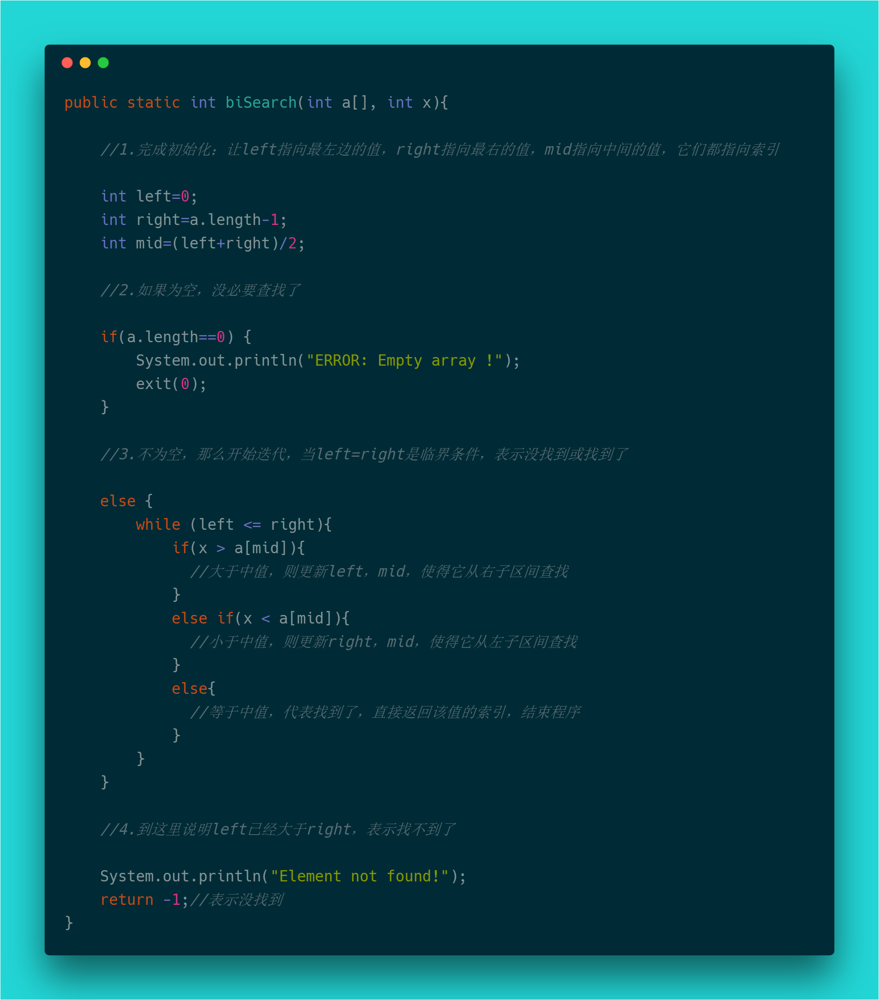
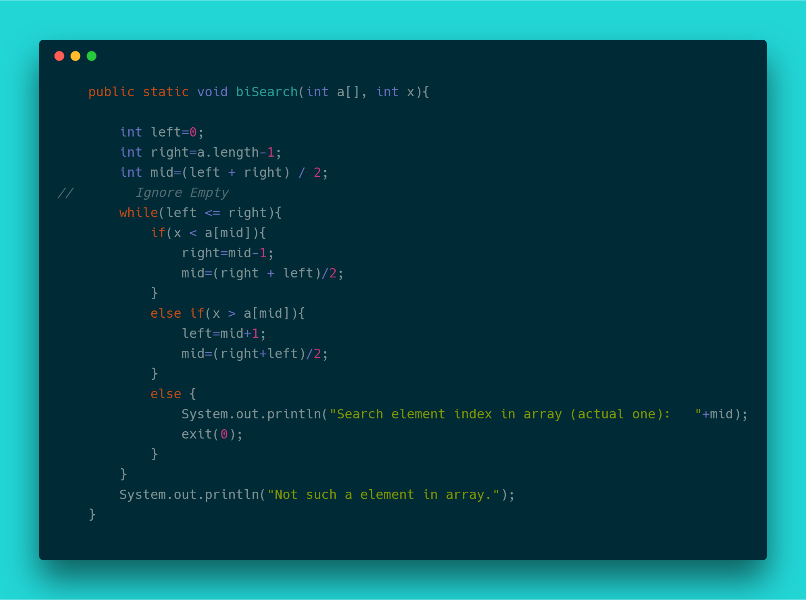
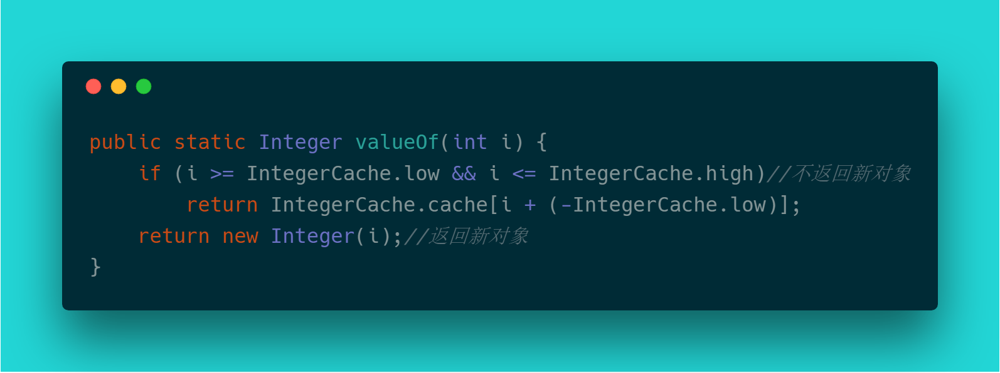
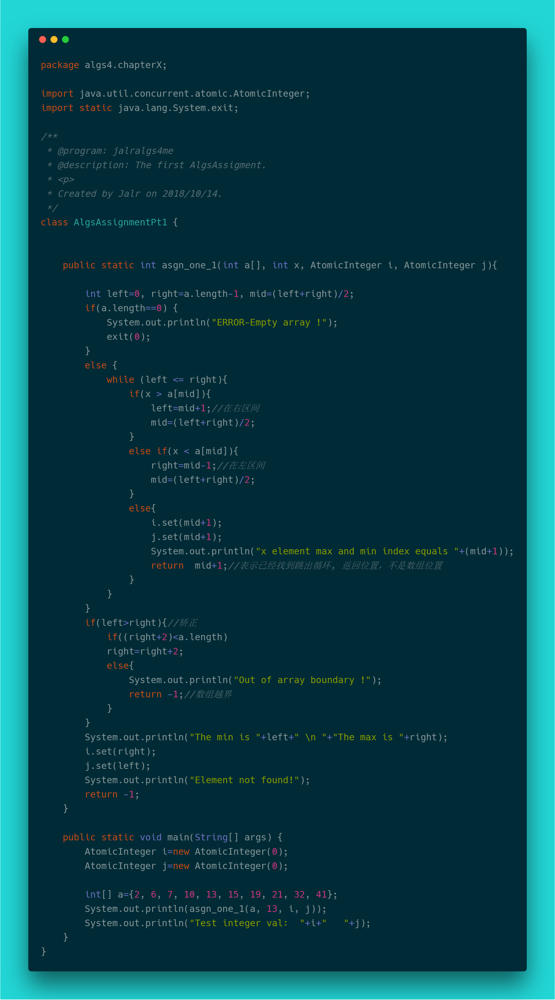
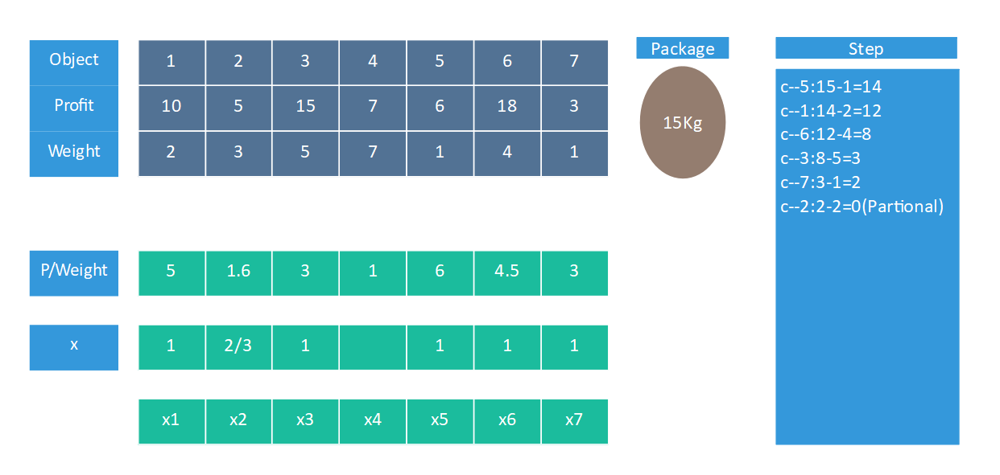

# JalrAlgsHome
> 学校的算法课作业有点意思，记录比算法第四版课后题更有难度的算法的一些分析
>

- 第一题：

  - **问题**：设a[0:n-1]，是已排好序的数组，请改写二分搜索使得当搜索元素x不在数组中时，返回小于x的最	  大元素位置i和大于x的最小位置j。当搜索元素x在数组中时，i和j相同，均为x在数组中的位置。

  - **思想**：二分查找，只针对有序的数组或者说表而言，参数只有两个，指定要查找的数组与要查找的元素，让left指向最左边的元素，让right指向最右边的元素，mid指向中间的元素，当然left，right，mid都只是数组的索引，然后就是不断在子左区间与子右区间迭代查找的过程，如果查找值小于中值，更新right与mid，使得在左区间，如果查找值大于中值，更新left与mid，使得在右区间。详细见下：

    **我的模板**：

    

    **我的实现**：

    

  - **分析**：这题要写出来，那么二分查找是肯定得要写出来的，然后在二分查找的基础上改进就好了，有一些更形象易于思考的方法，步骤就是：

    - 在草稿纸假设一个数组，尝试描述数组的二分查找
    - 尝试在编译器中写出二分查找
    - 在二分查找基础上修改，求出答案

  - **注意**：由于Java本身的语言特性，往往会有一些很奇怪的坑，写这道题的过程就学习了，这里也记录一下，这里在写完后，发现 i 与 j 并没有按预计的那样传回来值，所以分析了没回传的原因

    - **伪 “引用传递”**：由于没有探索 Java 的参数传递，一直以为在堆内存，像数组，类，对象之类的，就是引用传递，当然 Java 自己也是这么描述的，不过实际上不是这样的。

      - **值传递**：每次方法调用就是复制了一份参数的值再传进去，对我们原来的数值是没影响的，这点和 C/C++ 是一样的

      - **引用传递**：每次方法调用复制了一份对象的地址的值再传进去，可以影响到地址所代表的值，这点和 C/C++ 是不一样的，因为也存在“值拷贝”，不过是地址的拷贝，但 C/C++ 中是没有拷贝的过程，直接传入指针的地址的，所以，虽然同样能影响到地址所代表的值，但 Java 是“值传递的调用”，C/C++ 是“引用传递的调用”

        其实说白了，C的引用传递是通过 & 这个取址运算符来实现的，实质上，**使用这个运算符就是不管参数类型是什么，对它再取了更高一级的地址，也就是指针**，所以每次函数取到的是参数的地址并就是引用传递了！然鹅，Java里面的是地址，传入的不是“地址的地址”，但它依然叫引用传递，这就是所谓的伪“引用传递”

        所以如果想对数组排序，在方法中把已经排好的临时数组的**地址**赋值给传进来的数组，这是不可能的，因为它是“单向的”，只能对传进来的数组一一赋值

        > Java is always pass-by-value.

        所以如果要实现二级引用，只能对现有的东西再封装成类。

    - **Integer的常量池**：题目中要求一个函数返回多个值的，i和j，那么按道理实现来说，用int型的封装类Integer即可，但没有用，所以分析了Java中引用调用的坑，然后发现并不是这个问题，Integer固然就是对象了，所以有了上面的知识后，对传进来的那个参数直接操作即可，但发现还是有奇怪的错误，查了Integer源代码可以发现它是这么实现的：

      

      这个方法是在 Integer 装箱拆箱用到的，反正无论怎样都会用到它，从上可以看到为了提高性能，Integer 设置了一个常量池，范围是 -128~127，也是说，如果你实例化的 Integer 对象是在这个范围的话，那么它们将引用的是同一个对象，这个例如实例化两个 Integer 对象，它们的值都为9时，它们的地址是一样的，只有大于常量池，才会在堆内存真正给你建立一个对象= =

      解决方案，有三种：

      - 对 Integer 再封装一次，强制建立一个对象，自己的对象那么值肯定就不一样了
      - 使用原子对象 AtomicInteger ，这个就没有Integer那个常量池限制了，用起来不会有问题

  - 题目答案：有了以上的分析与补坑，终于可以写出来了

    

------

- 第二题：

  - **问题**：给定n种物品和一个背包。物品i的重量是Wi，其价值为Vi，背包的容量为C。应如何选择装入背包的物品，可以选择物品i的一部分,使得装入背包中物品的总价值最大?

  - **思想：**贪心算法，将问题每次分解成子问题，并在一次次解决子问题后，使得问题最终得到解决。在解决子问题时总是选择局部最优解，而且不考虑后果，从而达到全局最优解。并不是每一种问题都适合采用这种策略的，例如：

    

    现在，要求这棵二叉树的权值最大值，如何选？

    - **正确答案**：11+3+65=**79**

    - **贪心策略答案**：11+8+22=**41**

      应用贪心策略，这里选择的是局部最优解，第二层选大的是8，接着第三层选大的是22，然而，并不是全局最优解！

  - **分析：**贪心算法的问题中，背包问题是一种很经典的可以利用贪心求解的问题，那么理解一下题目的意思后，可以开始写，这里同样也有更形象易于思考的方法：

    - 在草稿纸画出来，假设一个重量数组，价值数组，权值重量比数组，选择的货物比例x数组，然后写出用贪心求解的每一步，具体如下：

      

      如上，假设出初始化的货物数据，背包的 capacity 为15kg，以及选择的 step，第一次选 货物5，第二次选 货物1，第三次选 货物6...... 最后选的就是 货物2，然而 货物2的重量为 3kg，这里不是 01背包 问题，可以选部分的，所以，选择的 3kg 中的 2kg 部分，那么对应的x数组中的选择就为 2/3！背包此时为空了，那么其他的 货物 没选上，对应的x数组的值直接赋为0

    - 接着用贪心策略：就是每一次选取权值重量比最大的再与对应的x的值，也就是选择比例相乘—p[i]*x[i]，再依次相加，即可

    - 具体实现的思路：对p/weight排序！再利用这个权值重比数组与背包容量来进行step操作

    - 背包问题模板：

      

  - **注意**：本次在用 Java 实现时还是碰到了许多坑，**Sort() 方法要如何实现，到底如何对w、v、v/w同时排序？**因为这三个数组是一一对应的关系的，基于 Java 想到了三种解决方案，不过由于题目与引用传递限制，还是只能用一种：

    - **用HashMap映射**，有了<key, value>存储方式后，就可以用<v/w, <v, w>>这样一种方式排序了

    - **用货物类Product**，封装三个数据成有三个私有的字段value, weight, value/weight，然后用这种数组实例化一个数组后，可以相应排序

    - **用二维数组存三种数据**，二维数组是n行3列的，每一行代表一个货物，一行的三列可分别对应value, weight, value/weight，所以每次排序交换时，最后还是选择用这种方案实现了，如下：

      

  - **题目答案**：综上终于可以写出题目答案了

    
