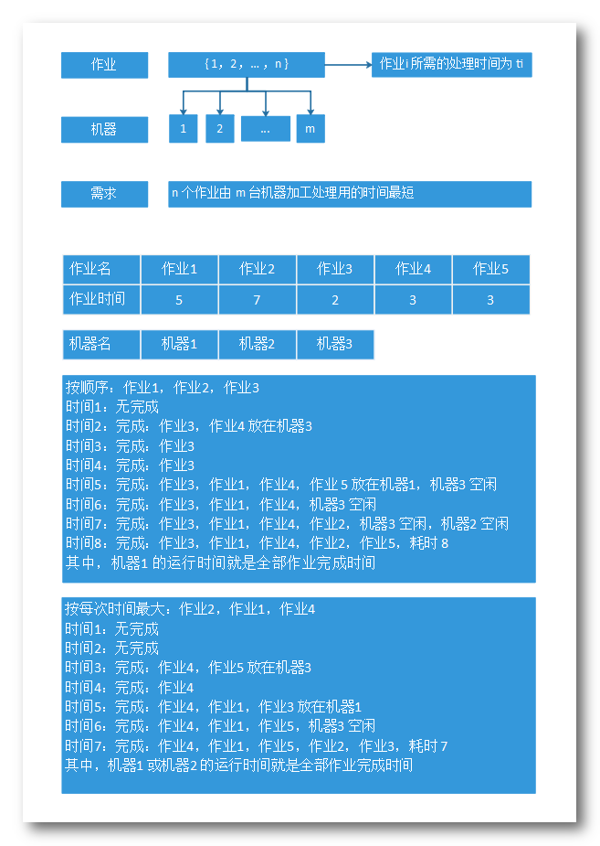
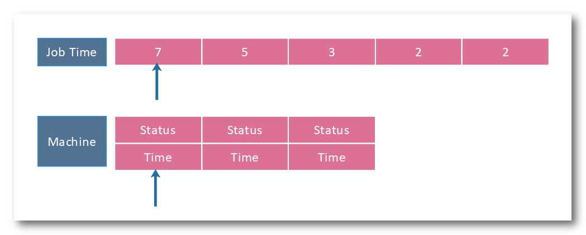

第四题：

- **问题**：设有n个独立的作业 { 1，2，… ，n } , 由m台相同的机器进行加工处理。作业i所需的处理时间为 ti。现约定，任何作业可以在任何一台机器上加工处理，但未完工前不允许中断处理。任何作业不能拆分成更小的子作业。

  多机调度问题要求给出一种作业调度方案，使所给的 n 个作业在尽可能短的时间内由m台机器加工处理完成。

- **思想：**贪心算法，将问题每次分解成子问题，并在一次次解决子问题后，使得问题最终得到解决。在解决子问题时总是选择局部最优解，而且不考虑后果，从而达到全局最优解。

- **分析：**这道题还是利用贪心算法，一开始还不知道如何下手，以为是经典的贪心问题之一，油管看了关于相关的视频，如 "Job Sequencing with Deadlines - Greedy Method" 之类的后，竟发现不一样，这个是多机调度问题求最短时间，而有 deadlines 的那个是经典的，求如何在最短时间经可能完成多个作业。但好久没看算法，有了感觉后，自己设置一些测试用例后，便可以理解题意：

  - 在草稿纸画出来，假设作业所用时间为：{ 5, 7, 2, 3, 3 }，机器有三台：{ m1, m2, m3 }，那么会发现，按原顺序，或其他作业顺序分配给机器，得到的时间是不一样的，而且按照作业从大到小分配，时间从 7, 5, 3, 3, 2 这个序列执行时，是最短的！是具体分析如下：

  

  - **接着用贪心策略**：思路已经有了，那么就是每次机器空闲时分配给机器的都是最长的那个时间的作业就好了！

  - 具体实现的思路：

    - timeNeed[n]：存 n 个作业所需的时间
    - machine\[2][m]：设了两个域，第一行存 m 个机器的状态，是否可用，第二行存当前机器承载作业的运行时间
    - AVAIL：宏定义为 -1，表示可用
    - UNAVAIL：宏定义为 -2 ，表示不可用
    - nextJob：整数模拟的一个指针，指向数组的第一个**将要放入机器**的作业时间

    

- **总结**：本次在用 Java 实现时还是碰到了许多坑

  - **不会 HashMap**：还是不会，就又用二维数组和整型的宏定义描述了机器的数据结构以及指针，效率还是挺低的...

  - **类中的字段**：以及数组的初始化，这些都需要在主类中初始化的！

  - **冒泡**：写一次忘一次的冒泡，好在思路简单，想了想还是撸出来了，但比之前好一点了，就是还是有个感觉很 low 的 if 判断越界，还是要系统学习一下八大排序，得选个效率高的作为御用算法

    总的来说，就是**还是很菜，缺少练习**！

- **题目答案**：用举个简单例子的方法去分析很形象，但往往答案片面，例如这次也是一样，本来都已经在写这篇分析文档了，但最后发现还有可能是作业数 n 小于或等于 机器数 m 的情况！这时因为machine数组的列数越界的问题，后面发现少了一种情况的分析。**原本的判断只针对 n>m 的情况**，因此改起来又很蛋疼，但最后还是改好了，就是退出运行的死循环中，要两个条件：

  1. nextJob 指针已经指到底（这里用 timeNeed[n]中越界的第一个索引 n 表示，即 nextJob = n）
  2. machine\[2][n] 中所有的 第一行也就是 Status域 都为 UNAVAIL，实现方法是用一个 布尔值 每次对machine数组遍历判断

  答案如下：

  